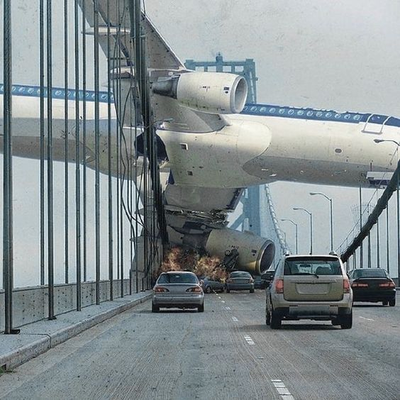

# AVIATION RISK ASSESSMENT ANALYSIS(MY PHASE 1 PROJECT)

## Project Overview
The aim of this project is to analyze aviation accident data to identify the lowest-risk aircraft for potential purchase by our company. We shall involve data cleaning, imputation, analysis and visualization, culminating into actionable insights and recommendations for business stakeholders.

## Business Understanding
Our company is expanding into the aviation industry and requires to find out about potential risks linked with different kind of aircraft. Some of the key business questions to ask are:

* What is the distribution of accidents over time?
* What types of aircraft have the highest and lowest risk based on historical accident data?
* What are some of the factors leading to most aviation accidents?
The stakeholders include:

* Head of Aviation division
* Company Executives

## Data Understanding
_*Data Source and Description*_
The dataset is sourced from the National Transportation Safety Board covering aviation incidents from 1962 to 2023. It is contains over 80,000 aviation accident records detailing the date of their event,aircraft type, severity of the accident, number of casualties and fatalities and more. The data is stored in a .csvfile named AviationData.csv.

## Data Analysis
Cleaning our data is effective in getting good analysis for data visualization. We shall use various functions during data cleaning so as to handle things like null values, duplicates, mixed data types etc.
This will help us obtain correct values to work with for carrying out risk assessment tests for different aircraft and in understanding some of the factors that majorly contribute to aviation accidents.

## Conclusions and Recommendations
_*Summary*_
1. **Trends over Time**
- The overall number of accidents has decreased over the past decades suggesting that safety measures and new advanced technologies have aided in curbing aviation accidents. This trend highlights the effectiveness of advancements in aviation safety practices and regulatory changes.

2. **Highest and Lowest Risk Aircraft**
- The analysis identifies aircraft types with the highest and lowest risk based on fatal injuries per accident. Some aircraft manufacturers have higher rates of fatalities per accident as compared to others 
 indicating where safety enhancements should be made as well as help reach the company to a decisive conclusion for which aircraft to be purchased.

3. **Some Factors Contributing to Accidents**
- Certain factors such as the condition of weather,specifically `VMC` was associated with majority of the accidents perhaps been due to pilot error or aged aircrafts.
- Another factor we put into consideration is the phase of flight and in which phase most accidents occur drawing the result that most aircraft accidents appeear to get accidents during the landing phase.
Understanding these factors will help stakeholders focus on targeted interventions such as enhanced pilot training and robust maintenance protocols for aged aircrafts.

[This is my dashboard that contains my analysis on aircraft accidents](https://public.tableau.com/app/profile/john.isaac1748/viz/AviationTableau_/Dashboard1?publish=yes)

